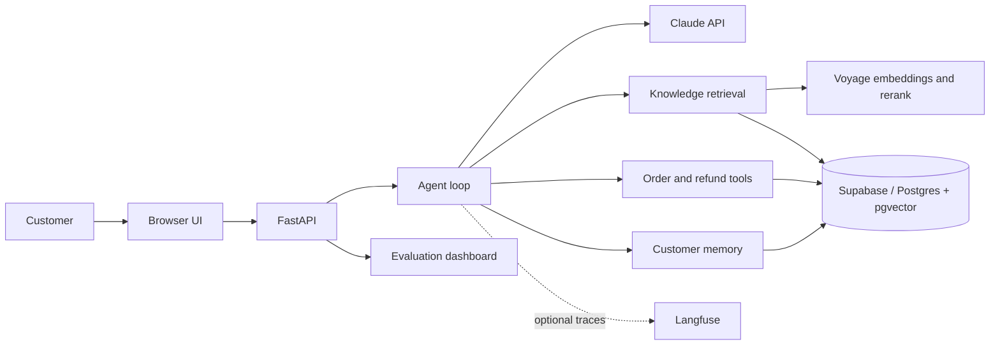

# SupportBot

An e-commerce support agent that answers product questions from a grounded knowledge base, looks up orders, guides refunds, and remembers customer context.

[Read the build notes](https://himanshu-sharma.medium.com/i-kept-adding-ai-to-my-support-bot-it-kept-breaking-in-new-ways-49b1ae4ff658)

[Related case study: Dinsko AI support agent](https://www.nocodeassistant.agency/blog/ai-support-agent-ecommerce/)

Stack: Python, FastAPI, Claude API, Voyage AI, Supabase, Postgres, pgvector, and Langfuse.

## Architecture



Without API keys, the same API runs with deterministic routing and in-memory knowledge and order data.

## Repository guide

- [`plans/decisions/`](plans/decisions/) contains the architecture decisions.
- [`docs/changelog.md`](docs/changelog.md) contains the phase history.
- [`docs/benchmark.md`](docs/benchmark.md) contains benchmark results.
- [`docs/eval.md`](docs/eval.md) explains the metrics and test limits.
- [`plans/roadmap.md`](plans/roadmap.md) lists remaining work.
- [`plans/archive/`](plans/archive/) contains old plans.

## Request flow

Start the server, open [`frontend/index.html`](frontend/index.html), and send:

> My order ORD-1002 arrived damaged, I want a refund.

The request shows:

- streamed response tokens.
- `lookup_order` and `request_refund` tool activity.
- the knowledge documents used for the answer.
- phase 1, 2, and 3 responses on the same query.

## Current features

| Feature | Status |
|---|---|
| Knowledge questions | Hybrid text and vector retrieval with optional Voyage reranking |
| Order lookup | Supabase with an in-memory fallback |
| Refund requests | Checks delivery status before the request |
| Chat UI | Streams tokens, tool activity, and sources over SSE |
| Customer memory | Stores orders and facts in Postgres with a 90-day fact TTL |
| Tests | Retrieval, agent, unsafe request, synthetic, and end-to-end checks |
| Results page | Available at `GET /eval` and `GET /eval/memory` |
| CI | Checks saved retrieval and unsafe request baselines |
| Tracing | Optional Langfuse traces for live runs |

## Known limits

| Area | Current limit |
|---|---|
| Access | No authentication, tenant isolation, or rate limiting. CORS is open |
| Agent loop | No limit for tool rounds, tokens, cost, retries, or request time |
| Customer memory | Stored facts aren't cleaned before they enter later prompts |
| Errors | Some internal errors can reach the client |
| Database | Connections aren't pooled |
| Human handoff | It isn't connected to an external support system |

## Quick start

```bash
pip install -r backend/requirements.txt
uvicorn backend.app.main:app --reload
```

Run tests:

```bash
python3 -m pytest backend/tests/ -v --tb=short
```

Tests that need `DATABASE_URL` or `VOYAGE_API_KEY` skip when those values are missing. Without `.env`, the bot uses in-memory data and deterministic routing.

## Optional: Supabase, Voyage AI, and Claude

Add these values to `.env`:

```text
SUPPORTBOT_DATA_BACKEND=postgres
DATABASE_URL=<supabase-postgres-url>
VOYAGE_API_KEY=<voyage-api-key>
ANTHROPIC_API_KEY=<anthropic-api-key>
```

Apply [`backend/sql/schema.sql`](backend/sql/schema.sql) in Supabase. Then apply these migrations:

- `migrate_5c_metadata.sql`
- `migrate_7_customer_memory.sql`
- `migrate_8_memory_wiring.sql`

Import the included Olist data and the knowledge documents:

```bash
python3 -m backend.app.cli import-orders --dataset-dir ./data-set --limit 10000
python3 -m backend.app.cli import-knowledge --knowledge-dir ./backend/knowledge
```

## Example requests

Ask a policy question:

```bash
curl -s -X POST http://localhost:8000/api/chat \
  -H "Content-Type: application/json" \
  -d '{"session_id":"example","message":"Can I get my money back?"}' | jq
```

Request a refund:

```bash
curl -s -X POST http://localhost:8000/api/chat \
  -H "Content-Type: application/json" \
  -d '{"session_id":"example","message":"My order ORD-1002 arrived damaged, I want a refund."}' | jq
```

Use customer memory:

```bash
curl -s -X POST http://localhost:8000/api/chat \
  -H "Content-Type: application/json" \
  -d '{"session_id":"example","message":"What is my order status?","customer_email":"alice@example.com"}' | jq
```

## Tests and evals

The retrieval test has 15 documents and 62 questions. Of these, 52 have an expected answer. The tests compare retrieval methods and check for drops against the saved results. A smaller end-to-end set checks the final answer and tool calls together.

```bash
# Test all retrieval methods
python -m backend.eval.run --all-modes --benchmark

# Use Claude to check whether the retrieved text is relevant
python -m backend.eval.run --all-modes --llm-judge --benchmark

# Test tool choice, refusals, unsafe requests, and full answers
python -m backend.eval.run --agent-eval
python -m backend.eval.run --adversarial-eval
python -m backend.eval.run --e2e-eval

# Create and run more test questions
python -m backend.eval.generate_queries --api-key $ANTHROPIC_API_KEY
python -m backend.eval.run --all-modes --query-set synthetic
python -m backend.eval.run --all-modes --query-set both
```

Each run saves JSON files in `backend/eval/results/`. The results page is at `GET /eval` when the API is running.

[`docs/benchmark.md`](docs/benchmark.md) has the result table, cost and latency charts, and run history. [`docs/eval.md`](docs/eval.md) explains the metrics.

The tests cover retrieval, tool choice, refusals, unsafe requests, and a small set of full conversations. They don't cover every order ID format, every unknown order response, or every difference between the in-memory and Postgres paths.

Built by [Himanshu Sharma](https://nocodeassistant.agency).
